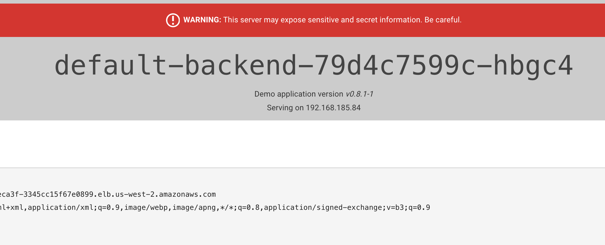

# Ingress 


Load Balancers are pretty great.  But using the previous method, for each service we want to expose outside our cluster we will need to create a new load balancer.  

An Ingress Controller is a way we can multiplex our load balancer.  That is we can have one Load Balancer with rules on the back end that point to different services. 

## Change Back `ngx` service to ClusterIP

```
kubectl edit svc ngx
```

Change from LoadBalancer to `ClusterIP`.  You'll have to remove the `NodePort` that was created.  This will delete the Network Load Balancer. 

## Deploy Nginx Ingress Controller

(See latest version to download: [here](https://kubernetes.github.io/ingress-nginx/deploy). )

```
kubectl apply -f https://raw.githubusercontent.com/kubernetes/ingress-nginx/controller-v0.41.2/deploy/static/provider/aws/deploy.yaml
```
This will create resources in the `ingress-nginx` name space. 

We've updated the configMap to make it compress the output for better performance of our applications.  The configMap has this now: 

```
data:
  use-gzip: "true"
  gzip-level: "7"
  enable-brotli: "true"
  brotli-level: "7"
```

Running: 

```
kubectl get svc -n ingress-nginx
```

Will show the NLB configuration.  Let's open to that webpage and see what it shows. You'll see a 503 Service Unavailable error.  That's because its not pointing to anything. 

  

## Deploy Default Backend Ingress Rule

You can have a customized 404 page so when people hit a domain that is not in your rules they can go there.  For our purposes we will create an app.  

```
kubectl apply -f default-backend.yaml
```

Now we have a default service running when no ingress rules are specified.  We can make this page say anything we want, just point it to a different service. 

This `yaml` file creates a deployment of an application called `kuard` which just gives information about the server we are on. The new part in this `yaml` file is the end of a `kind: Ingress`.  This is where we would put rules.  Since we don't have any rules in here, it just becomes the default app to route to. 



## Update our nginx App with an Ingress Rule

We have a domain called [castlerock.ai](https://castlerock.ai) that we can use for this service.  Let's create an ingress rule.  The file in this directory called `ngx-ing.yaml` has the information below: 

```
---
apiVersion: networking.k8s.io/v1
kind: Ingress
metadata:
  annotations:
    kubernetes.io/ingress.class: nginx
  name: ngx
spec:
  rules:
    - host: k8s.castlerock.ai
      http:
        paths:
          - path: "/"
            pathType: Prefix
            backend:
              service:
                name: ngx
                port: 
                  number: 80

```

The rule here shows that anytime the host is `k8s.castlerock.ai` it will route to our ngx service.  

```
kubectl apply -f ngx-ing.yaml
```

Then we can see all our ingress rules in the default namespaces: 

```
kubectl get ing
```

To get the nginx service we have to specify the host name.  Since we don't have that mapped yet, we can spoof with curl. 

```
curl -H "Host: k8s.castlerock.ai" a33115333837945aa9abd45ae3deca3f-3345cc15f67e0899.elb.us-west-2.amazonaws.com
```

Now our ingress controller is up.  We just need to set our DNS to hit this load balancer to map to the services.  Remember: An ingress controller is just a normal kubernetes service that listens to ingress events and then maps to those when it is hit from the outside. It allows us to multiplex our LoadBalancer!


