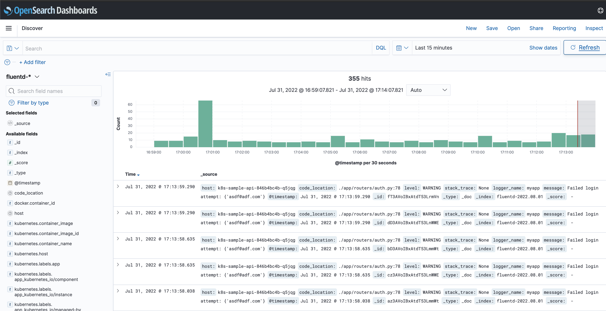
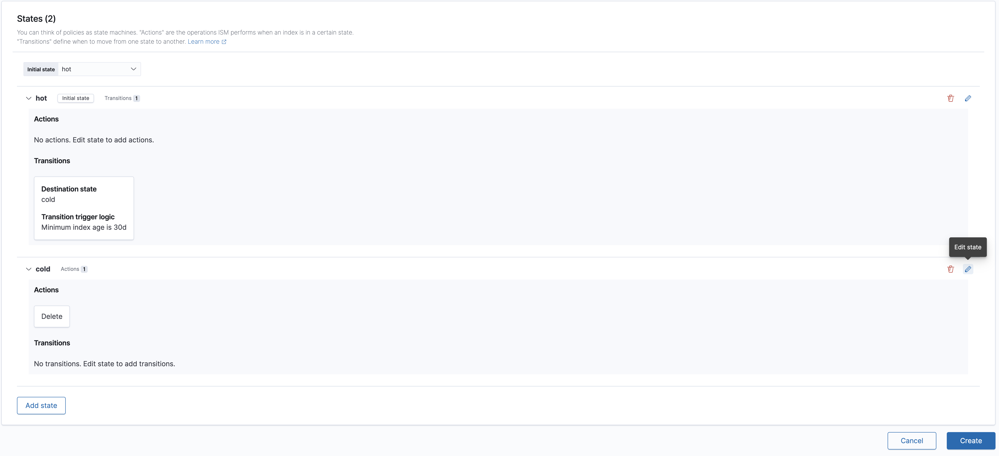
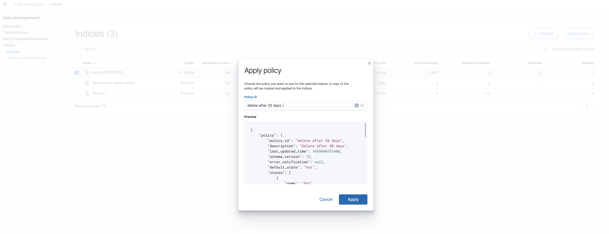

# Application Logging

One way we can ensure we have a handle on what our application is doing is by having a centralized logging area where all our logs are created.  

Since we already have fluent set up, let's log everything in our application and test it out. Then we can filter the logs to only show logs for our application. 

## Edit Fluentd

Let's not get all those logs, but let's only do the logs for our app: 

```
helm upgrade --install -n fluentd fluentd -f values2.yaml fluent/fluentd
```

## Logs

There are some changes we made with this next version: 

* We are accepting logs from port `24224`
* The app now forwards logs to this port for different portions. 
* If you look at the app at `app/lib/app_logging.py` you can see how we set up the logging. 
* Before the default settings scraped the logs from the individual nodes.  It still does this but now the app forwards to fluent on its own.  Fluent in turn flows to OpenSearch.



## Curate the Logs

Opensearch allows us to delete after X number of days



We create the policy first. Then apply it to the fluentd group




## Make a Dashboard

In Discover we can save our search with 

```
logger_name:myapp
```
We can then do `Save` to save this search.  We can then add this to a dashboard, or use it to quickly look back to. 